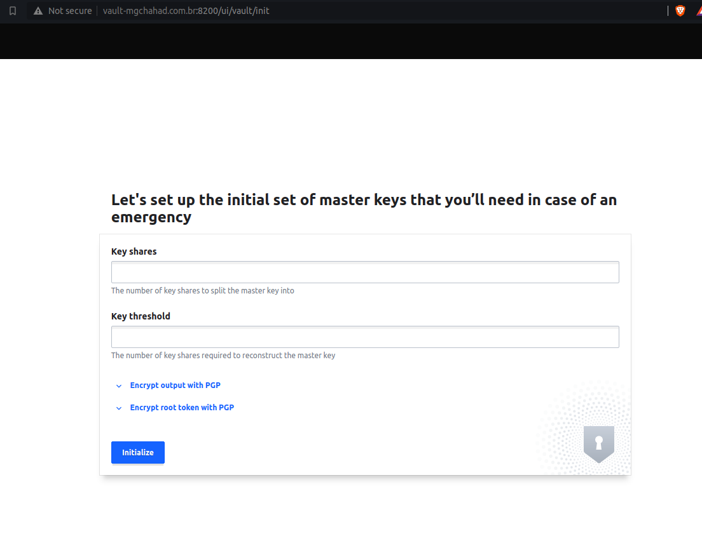

# Procedimento de configuração do Vault em modo HA
## Requisitos
Serão necessárias as soluções abaixo para a configuração do Vault:

* [Docker](https://www.docker.com/)
* [Docker Compose](https://docs.docker.com/compose/)

## Instalação

### Criando certificado SSL/TLS
Será necessário criar um certificado auto-assinado para que o Vault trabalhe em modo HTTPS. Para isso, crie um diretório com nome de "ssl" na raiz do projeto, acesse o diretório e execute os comandos abaixo:

* Gerando a chave KEY:
```
openssl genrsa -out certificado.key 4096
```
* Gerando o arquivo CSR:
```
openssl req -new -key certificado.key -out certificado.csr
```
* Gerando certificado auto-assinado:
```
openssl x509 -req -days 365 -in certificado.csr -signkey certificado.key -out certificado.crt
```

Após gerar os arquivos do certificado, utilize o comando abaixo para ajustar as permissões dos arquivos. Lembre-se de executar o comando dentro do diretório "ssl":
```
sudo chmod 0775 *
```


### Arquivo de configuração
Crie um diretório chamado "config" na raiz do projeto, acesse o diretório e adicione o arquivo de configuração abaixo:

```
{
    "listener": [
        {
            "tcp": {
                "address": "0.0.0.0:8200",
                "tls_disable": "0",
                "tls_cert_file": "/vault/cert/certificado.crt",
                "tls_key_file": "/vault/cert/certificado.key"
            }
        }
    ],
    "api_addr": "https://vault-mgchahad.com.br:8200",
    "cluster_cipher_suites": "TLS_ECDHE_RSA_WITH_AES_128_GCM_SHA256,TLS_ECDHE_ECDSA_WITH_AES_128_CBC_SHA",
    "storage": [
        {
            "mysql": {
		"username": "vault",
        "password": "vault",
        "database": "vault",
        "table": "vault-data",
        "address": "192.168.1.157:3306"
            }
        }
    ],
    "max_lease_ttl": "10h",
    "default_lease_ttl": "10h",
    "cluster_name": "vaultcluster",
    "ui": true,
    "pid_file": "/tmp/pidfile",
    "raw_storage_endpoint": true,
    "disable_sealwrap": true
}
```

*Obs.: Aplique os ajustes necessários com base no nome de domínio que foi configurado durante a emissão do certificado e altere o endereço IP do storage para o de seu computador.*

### Iniciando Cluster Vault
Para iniciar os containers de Vault + Mysql, utilize o comando abaixo:
```
docker-compose up -d
```

Aguarde alguns segundos para que o serviço esteja online e acesse o Vault utilizando a URL com o nome do domínio definido para o certificado auto-assinado. Lembre-se de adicionar o apontamento no arquivo "hosts" do seu computador.

Se a tela abaixo for apresentada significa que o Vault foi iniciado com sucesso ;)


